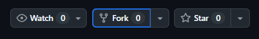
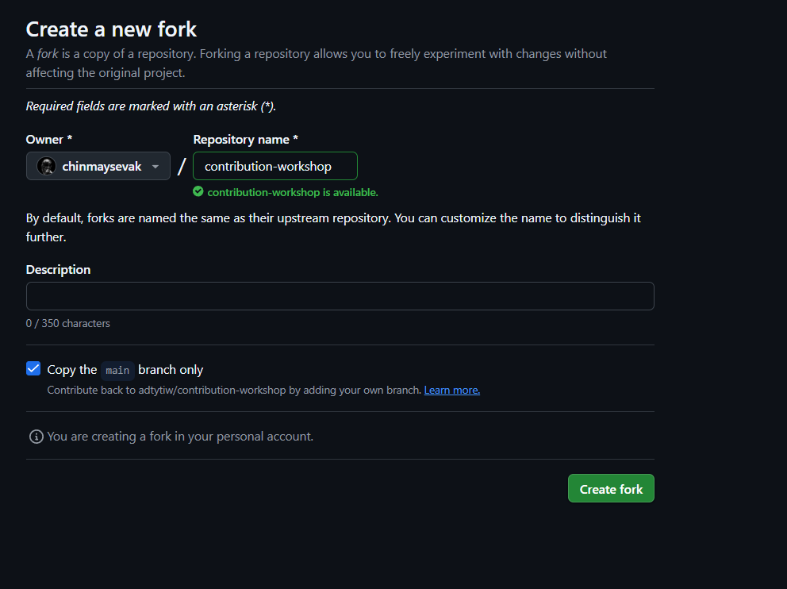
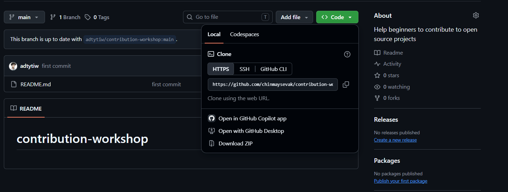
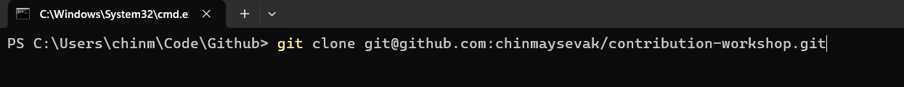
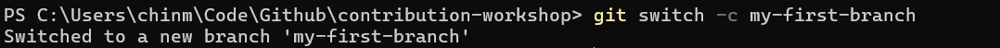
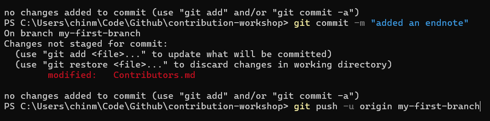
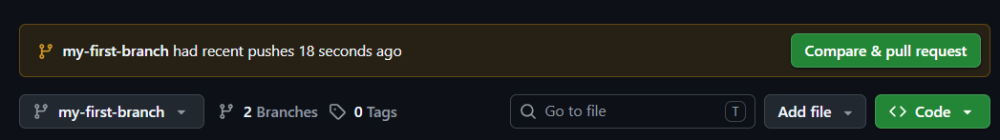

# Contribution Workshop

Make your first contribution to this repository by adding your name to [Contributors.md](Contributors.md).

## What you will do

1. Fork this repository.
2. Clone your fork to your computer.
3. Create a branch.
4. Add your name to `Contributors.md`.
5. Commit and push your change.
6. Open a pull request.

## 1. Fork the repository

Click **Fork** in the top-right corner of this repository’s GitHub page. GitHub creates a copy of the project in your own account.



On the next page, confirm the repository name and select **Create fork**.



## 2. Clone your fork

Open your fork on GitHub. Select **Code** and copy the repository URL. You can use either HTTPS or SSH—use the same URL you copied in the command below:

```bash
git clone YOUR_REPOSITORY_URL
cd contribution-workshop
```



The terminal example below uses SSH; use the URL format that works for your account.



## 3. Create a branch

Give your contribution its own branch:

```bash
git switch -c my-first-branch
```



## 4. Add your name

Open `Contributors.md`, add your name on a new line, and save the file.

```md
Your Name
```

Use the exact capitalisation shown above: `Contributors.md`.


## 5. Commit and push

Save your contribution to your branch and send it to GitHub:

```bash
git add Contributors.md
git commit -m "Add Your Name"
git push -u origin my-first-branch
```

The screenshot is a command reference; run the three commands above in order.



## 6. Open a pull request

Return to your fork on GitHub. Click **Compare & pull request**, check that the change is your name, and click **Create pull request**.



That’s it—your pull request is ready for review.
